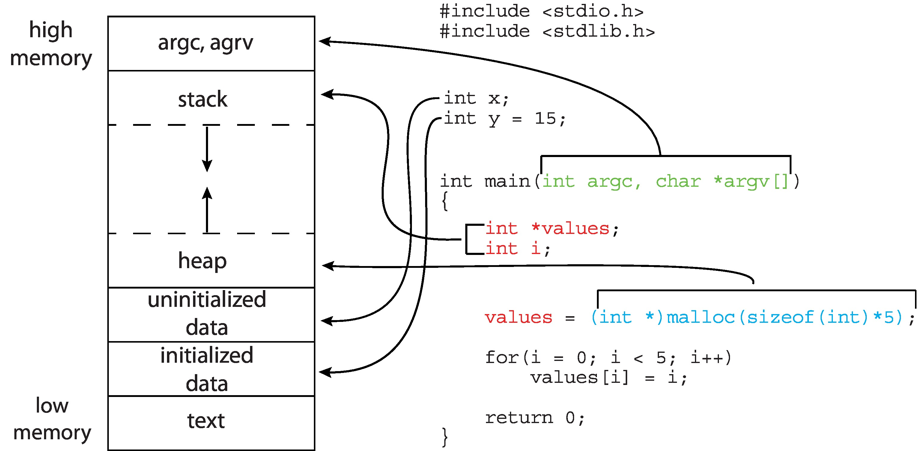
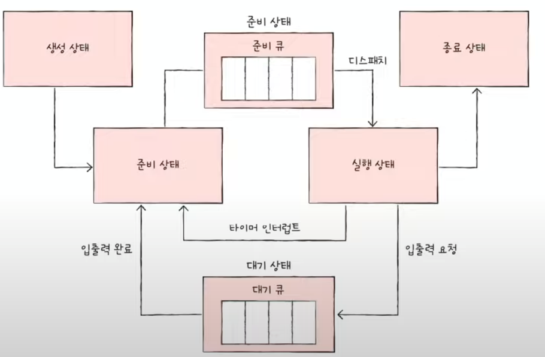
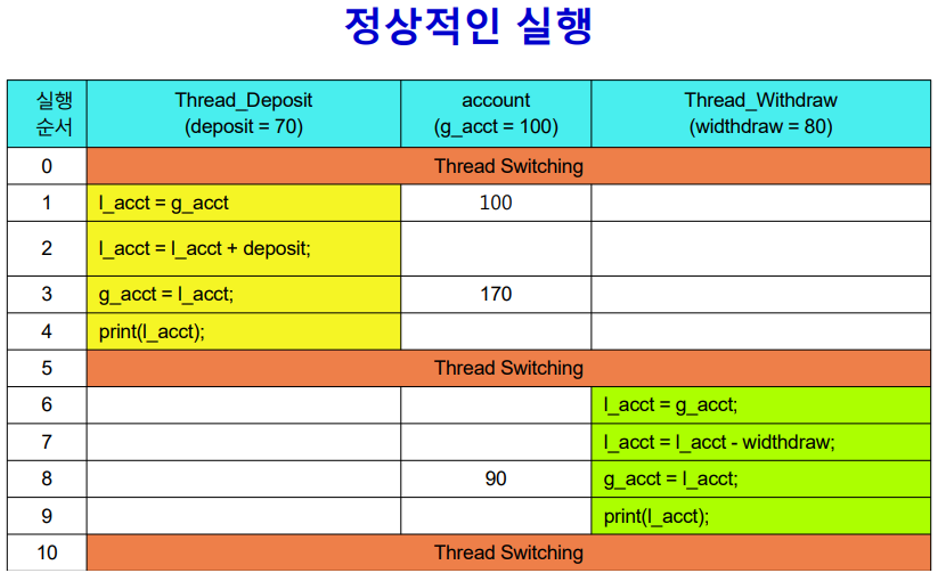
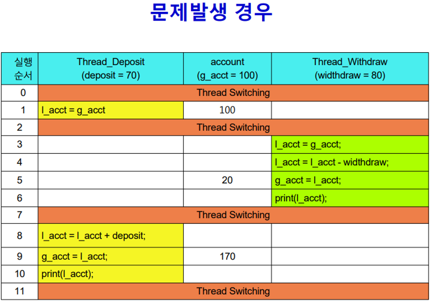
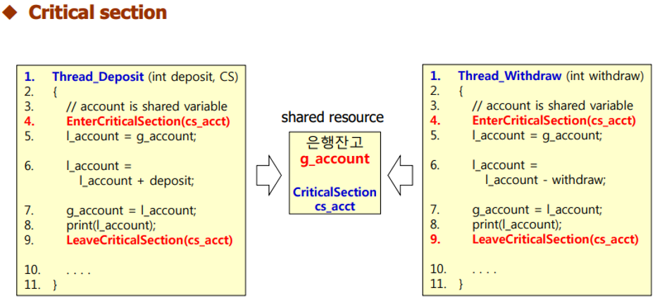
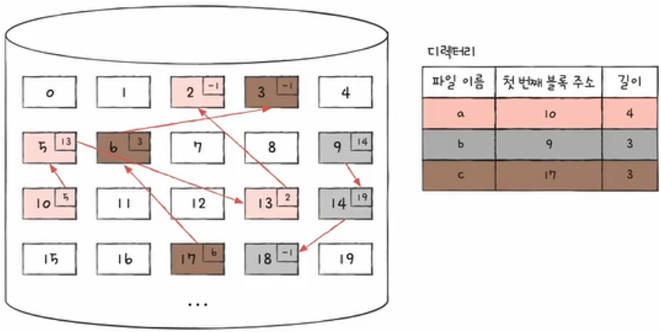
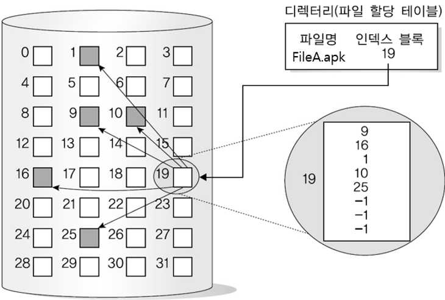

1. kernel
- 운영체제 == 커널
- 프로세스와 스레드의 올바른 실행되도록 돕고(실행 순서 제어), 
이들이 자원(CPU, 메모리, 보조기억장치 등)을 공정하게 할당받아 실행하도록 함.
또한, dual mode를 활용해 사용자 응용 프로그램이 안전하고 효율적으로 시스템 자원을 사용할 수 있도록 함.

2. system call & dual mode
* 메모리 영역 구분
- kernel space : 커널 프로그램 적재된 영역
- user space : 사용자 응용 프로그램이 적재되는 영역

- CPU는 명령어 실행 과정에서 user space 코드는 user mode, kernel space 코드는 kernel mode로 실행함
	-> 이렇게 2개의 모드로 구분하여 실행하는 것을 dual mode 라고 함
- user mode로는 시스템 자원에 직접 접근 불가(커널 영역 코드 실행 불가)
	-> 시스템 콜을 이용하여 kernel mode로 전환 후 kernel space 코드를 실행하여 자원에 접근

3. process & thread
- process
 : 운영체제로부터 자원을 할당받는 작업의 단위. 하나의 프로그램을 하나의 프로세스로 생각하면 됨.
- thread
 : 프로세스를 이루는 실행의 단위(실행 흐름의 단위)

- 프로세스 메모리 구조(user space)

4. PCB(Process Control Block)
운영체제가 프로세스에 대한 정보를 관리하는데 사용되는 자료구조
새로운 프로세스가 생성(메모리에 적재)되었을 때 커널 영역에 만들어지고, 프로세스 종료시 삭제됨

5. context switching
기존 프로세스의 문맥을 PCB에 백업하고(백업 전에는 이 정보가 CPU에 있음), 새로 실행하려는 프로세스의 PCB에서 문맥을 복구하여 새로운 프로세스를 실행
- 빈번한 context switching 발생시?
실제 작업보다 문맥 저장 및 복구에 CPU 시간을 더 많이 사용하게 되므로 CPU 효율성 저하됨.
또한 캐시 메모리 데이터를 반복적으로 무효화하게 되므로 캐시 미스율이 증가.
--> 캐시 미스와 문맥 교환 오버헤드로 인한 전체 시스템 처리 속도의 저하

6. 프로세스 상태

7. 멀티 스레드 & 멀티 프로세스

7.1 멀티 스레드 : 한 프로세스를 여러 스레드가 동시에 실행하는 환경
- 스택 영역, PC, 레지스터 값을 제외한 나머지 메모리 영역을 공유
--> 한 스레드에 생긴 문제가 그 프로세스 전체의 문제가 될 수 있음

7.2 멀티 프로세스 : 동시에 여러 프로세스가 실행되는 환경
- 서로 다른 프로세스는 기본적으로 자원 공유 X (독립 실행)
--> 한 프로세스에 문제 생겨도 다른 프로세스에 영향 적음

8. 프로세스 간 통신 (IPC)

8.1 공유 메모리 방식
- 프로세스간 공유하는 메모리 영역을 토대로 데이터를 주고받는 통신 방식
- 각 프로세스가 마치 자신의 메모리 영역을 읽고 쓰는 것처럼 통신 (속도 빠름)
- 통신 과정에 커널의 개입이 거의 없음
- 공유 메모리 영역에 대한 race condition 발생 가능
	--> ex) 프로세스 A, B가 있고 a.txt라는 파일을 매개로 통신. A가 a.txt에 쓰는 작업, B가 a.txt를 읽는 작업.
	--> 만약 프로세스 A, B가 부모 자식 관계가 아니라 아예 별도의 프로세스라면?
- ex) 프로세스 공유 변수, 파일 등

8.2  메시지 전달 방식
- 프로세스 간에 주고받을 데이터가 커널을 거쳐 송수신되는 통신 방식 (속도 느림)
- race condition, 동기화 문제를 고려할 일이 상대적으로 적음  --> 자세한 사례
- ex) 파이프, 시그널(직접적인 데이터 송수신은 안됨), 소켓, 원격 프로시저 호출(RPC) 등

9. 동기화와 교착 상태

9.1 임계 구역 : 공유 자원(프로세스 혹은 스레드가 공유하는 자원)에 접근하는 코드 중 동시에 실행했을 때 문제가 발생할 수 있는 코드 부분

9.2 race condition 
- 공유 자원에 대해 여러 개의 프로세스(or 스레드)가 동시에 접근 시도시 접근 타이밍이나 순서 등이 결과에 영향을 줄 수 있는 상태
- 프로세스 혹은 스레드가 동시에 임계 구역의 코드를 실행하여 문제가 발생하는 상황
--> race condition 방지 위해서 프로세스 및 스레드 동기화 필요

9.3 동기화 기법

9.3.1 뮤텍스 락
- 동시에 접근해서는 안 되는 자원에 동시 접근 불가하도록 상호 배제를 보장하는 동기화 도구
- 임계 구역에 진입할 수 있는 프로세스(or 스레드)의 개수가 1개

9.3.2 세마포
- 뮤텍스 락 보다 좀 더 일반화된 동기화 도구
- 임계 구역에 진입할 수 있는 프로세스(or 스레드)의 개수가 1개 이상

10. 교착 상태 (deadlock)
- 2개 이상의 프로세스가 서로 상대방의 자원을 기다리며 무한정 대기하는 상황

10.1 교착 상태 발생 조건
교착 상태는 아래의 4가지 조건을 모두 만족해야 발생 가능함
- 상호 배제 (mutual exclusion) : 한 프로세스가 사용하는 자원을 다른 프로세스가 사용할 수 없음
- 점유와 대기 (hold and wait) : 한 프로세스가 어떤 자원을 점유한 상태에서 다른 자원을 할당받기를 기다림
- 비선점 (no preemption) : 프로세스가 어떤 자원의 사용을 끝낼 때까지 그 자원을 뺏을 수 없음
- 원형 대기 (circular wait) : 각 프로세스가 순환적으로(원형으로) 다음 프로세스가 요구하는 자원을 가지고 있음
	즉, 각각의 프로세스가 서로 점유한 자원을 할당받기 위해 원의 형태로 대기하는 경우

10.2 교착 상태 해결 방법
10.2.1 예방 : 교착 상태 4가지 필요 조건 중 하나를 충족하지 못하게 하는 방법
10.2.2 회피 : 교착 상태가 발생하지 않을 정도로만 조심하면서 자원을 할당하는 방법.
		교착 상태가 발생하기 전에 교착 상태를 예상하여 안전한 상태 에서만 자원 요청을 하는 방법.
10.2.3 검출 후 회복 : 교착 상태 발생 여부를 주기적으로 검사하고, 교착 상태 발생 시 프로세스의 자원 선점을 
			통해 회복시키거나 프로세스 강제 종료를 통해 회복

11. CPU 스케줄링
11.1 선점형 스케줄링 : 운영체제가 프로세스로부터 CPU 자원을 강제로 빼앗아 할당 가능
11.2 비선점형 스케줄링 : 운영체제가 프로세스로부터 CPU 자원을 강제로 빼앗을 수 없음

12. CPU 스케줄링 알고리즘
- 선입 선처리(FCFS) : 준비 큐에 삽입된 순서대로 먼저 CPU를 요청한 프로세스부터 CPU 할당

- 큐가 보통 FIFO(먼저 들어들어간거 먼저 나옴) 구조임. 근데 준비큐, 대기큐에서는 꼭 먼저 들어간게 먼저 나가는건 아님.

- 최단 작업 우선(SJF) : 준비 큐에 삽입된 프로세스 중 CPU를 이용하는 시간의 길이가 가장 짧은 프로세스부터 CPU 할당

- 라운드 로빈
 : FCFS + time slice(프로세스가 CPU를 사용하도록 정해진 시간)
 : 준비 큐에 삽입된 순서대로 CPU 이용하되, time slice 안에 완료되지 않으면 준비 큐의 맨 뒤에 삽입됨

- 최소 잔여 시간 우선(SRT)
 : 정해진 타입 슬라이스만큼 CPU 이용 + 남아 있는 작업 시간이 가장 적은 프로세스에 다음 CPU 할당

- 우선순위
 : 프로세스에 우선순위 부여하여 가장 높은 우선순위부터 CPU 할당
 -->
문제점) starvation : 준비 큐에 우선순위가 높은 프로세스가 계속 들어오면, 우선순위가 낮은 프로세스는 계속해서 실행이 연기됨
해결) aging : 오랫동안 대기한 프로세스의 우선순위를 점차 높임

13. 가상 메모리

13.1 메모리 주소
- 물리 주소 : 메모리의 하드웨어 상 실제 주소
- 논리 주소 : 프로세스마다 부여되는 0번지부터 시작하는 주소 체계 --> CPU와 프로세스가 사용하는 주소 체계
- MMU(메모리 관리 장치) : CPU와 메모리 사이에 위치하며, 논리 주소를 물리 주소로 변환

13.2 스왑 영역 : 보조 기억장치의 일부를 메모리로 사용. 현재 실행되고 있지 않는 프로세스들 적재 용도

13.3 스와핑
- 메모리에서 사용되지 않는 일부 프로세스를 보조기억장치(스왑 영역)로 내보내고, 실행할 프로세스를 메모리에 적재하는 메모리 관리 기법
- 스왑 아웃 : 현재 실행되지 않는 프로세스가 메모리에서 스왑 영역으로 이동
- 스왑 인 : 스왑 영역에 있는 프로세스가 다시 메모리로 이동

13.4 메모리 할당 방식
- 연속 메모리 할당 : 프로세스에 연속적인 메모리 공간을 할당
	--> 문제점)	1) 외부 단편화(external fragmentaion) : 프로세스들 사이의 빈 공간보다 큰 사이즈의 프로세스를 적재하지 못하고, 이는 메모리 낭비로 이어짐
				2) 물리 메모리보다 큰 사이즈의 프로세스를 실행할 수 없음
		해결) 가상 메모리 : 실행하고자 하는 프로그램의 일부만 메모리에 적재해, 실제 메모리보다 큰 사이즈의 프로세스를 실행 가능하게 만드는 메모리 관리 기법

13.5 페이징
- 프로세스의 논리 주소 공간을 페이지라는 일정한 단위로 나누고, 물리 주소 공간을 페이지와 동일한 크기의 프레임이라는 일정한 단위로 나눈 뒤,
 페이지를 프레임에 할당하는 가상 메모리 관리 기법
- 프레임은 물리 메모리 내에 불연속적으로 배치될 수 있음
- 문제점) 내부 단편화(internal fragmentation)
		: 프로세스의 크기가 페이지의 배수가 아닐 때, 마지막 페이지에서 페이지 하나의 크기보다 작은 크기로 메모리 낭비가 발생

13.6 페이지 테이블
- 페이지와 실제로 적재된 프레임을 짝지어주는 정보 포함
- CPU가 프로세스 실행 시 각 프로세스의 페이지 테이블 참조하여 메모리에 접근
- 페이지 폴트 :  CPU가 메모리에 적재되지 않은 페이지(보조기억장치에 있는 페이지)에 접근하려고 할때 발생하는 예외
	--> 처리 과정
		1) 기존 작업 내용 백업
		2) 원하는 페이지를 메모리로 가져옴
		3) 메모리에 적재한 페이지 실행
- 페이징 시스템의 논리 주소는 기본적으로 <page number, offset> 형태 (page number 번 페이지의 시작주소로부터 offset 만큼 떨어진 곳 의미)
--> 예를 들어 page number : 1, offset : 3 --> 1번 페이지의 시작 주소에서부터 3번지 뒤를 가리키는 논리주소

13.7 계층적 페이징
- 모든 페이지 테이블 엔트리들을 메모리에 두는 것은 큰 메모리 낭비
- 페이지 테이블을 페이징하는 방식으로 메모리 낭비 문제 해결 (계층적 페이징)

13.8 요구 페이징
- 메모리에 프로세스를 적재할 때, 처음부터 모든 페이지를 적재하지 않고, 메모리에 필요한(요구되는) 페이지만을 적재하는 기법

13.9 페이지 교체 알고리즘
- 메모리에 적재된 페이지 중 보조기억장치로 내보낼 페이지를 선택하는 방법
- 메모리가 가득 찬 상황에서 추가적으로 페이지를 적재해야 한다면 메모리에 적재된 일부 페이지를 스왑아웃해야함
1) FIFO 페이지 교체 알고리즘 : 메모리에 가장 먼저 적재된 페이지부터 스왑 아웃
2) LRU 페이지 교체 알고리즘 : 가장 적게 사용한 페이지를 교체하는 알고리즘 (보편적으로 사용되는 페이지 교체 알고리즘의 원형)

14. 파일 시스템

14.1 파일 시스템
- 보조기억장치의 정보를 파일 및 디렉터리의 형태로 저장 및 관리할 수 있도록 하는 운영체제 내부 프로그램
- 한 OS에서 여러 파일 시스템 혼용 가능
- 파일시스템이 달라지면 보조기억장치의 정보를 다루는 방법도 달라짐

14.2 파일과 디렉터리
- 파일 = 파일 이름 + 파일을 실행하기 위한 정보(속성 또는 메타데이터라고 함) + 파일과 관련한 부가 정보
- 디렉터리 : 파일을 분류하기 위해 사용하는 이름공간. 트리 구조로 관리됨.
- 디렉터리는 디렉터리에 속한 요소(디렉터리 하위 요소들)의 관련 정보가 포함된 파일로 간주됨
- 디렉터리 하위 요소 정보는 디렉터리 테이블로 표현됨(각각의 행(디렉터리 엔트리)은 파일 이름, 위치 유추할 수 있는 정보가 포함됨)

14.3 파일 할당
- 운영체제는 파일과 디렉터리를 '블록'(보통 4096바이트 --> 4KB) 단위로 읽고 씀
- 파일 할당 방식
 1) 연결 할당(linked allocation)
	: 디렉터리 엔트리에 첫번째 블록 주소와 파일을 이루는 블록 단위의 길이가 명시

	
 2) 색인 할당(indexed allocation)
	: 파일을 이루는 모든 블록의 주소를 색인 블록(index block)이라는 특별한 블록에 모아 관리
	: 디렉터리 엔트리에 색인 블록 주소가 명시

	
 3) 연속 할당(contiguous allocation)

14.4 아이노드 기반 파일 시스템
- 색인 할당 방식의 파일 시스템
- 아이노드라는 색인 블록을 기반으로 파일 할당
- 아이노드에는 파일 이름을 제외한 파일의 모든 것이 담겨 있음
