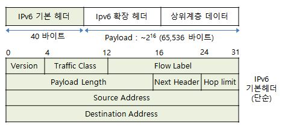

## 4.3 인터넷 프로토콜(IP): IPv4, 주소체계, IPv6 등

### 4.3.1 IPv4 데이터그램 포맷
[IPv4 헤더]

- 버전 번호(4bit) : IP 프로토콜 버전 (IPv4는 4, IPv6는 6)
- 헤더 길이(4bit) : 실제 데이터의 시작 위치를 결정. 헤더는 가변 길이의 옵션을 포함하므로, 헤더 길이 필드를 통해 페이로드 시작 위치를 결정.
- 서비스 타입(8bit, TOS) : IP 데이터 그램의 유형 구분.
- 데이터그램 길이(16bit) : '헤더 + 페이로드'의 바이트 사이즈
- 식별자(16bit), 플래그(3bit), 단편화 오프셋(13bit)
	: IP 단편화 관련 필드들. 
	  큰 IP 데이터그램은 여러 작은 IP 데이터그램으로 분할되는 IP 단편화가 일어나 목적지로 독립적으로 전달되며, 목적지에서 다시 합쳐짐.
- TTL(8bit, Time-To-Live) : 라우터가 데이터그램 처리시마다 감소. 0이 되면 라우터가 데이터그램 페기.
- 프로토콜(8bit) : 패킷이 목적지 도달시 패킷이 전달될 전송 계층의 프로토콜(TCP : 6, UDP : 17)
- 헤더 체크섬(16bit) : 수신한 IP 데이터그램 비트 오류 탐지용. 보통 오류 검출시 라우터에서 데이터그램 폐기.
- 출발지 IP 주소(32bit), 목적지 IP 주소(32bit)
- 옵션(32bit)

### 4.3.2 IPv4 주소체계
- 인터페이스 : 호스트(또는 라우터)와 물리적 링크 사이의 경계

[IPv4 주소]
- A.B.C.D/E 형태
--> 총 32bit, 8bit(옥텟)씩 끊어서 10진수로 표기하며 각 옥텟은 점(.)으로 구분. E는 서브넷 마스크(서브넷 주소)
- CIDR 표기법 : 기존에는 바이트 단위로 서브넷 마스크 설정. but CIDR는 비트 단위로 설정.

### 4.3.3 네트워크 주소 변환(NAT)

- 특정 IP주소와 포트번호 쌍에 대응되는 주소, 포트번호를 NAT 변환 테이블에서 찾아서 변환

### 4.3.4 IPv6
- IPv4 주소 공간이 빠른 속도로 고갈되어감에 따라 개발됨

- 주소 크기 확장(32bit -> 128bit)

- 애니 캐스트 도입(클라이언트와 가장 가까운 호스트가 응답)
- 옵션 필드 삭제로 헤더 길이 고정(40byte) --> 더 빠른 처리 가능
- 흐름 레이블링
- 단편화/재결합을 종단 시스템에서만 수행

[IPv6 헤더]

- 버전 : IP 버전 번호(IPv4: 4, IPv6: 6)
- 트래픽 클래스 : 특정 애플리케이션 데이터그램에 우선순위를 부여하는데 사용
- 흐름 레이블 : 데이터그램의 흐름 인식하는데 사용
- 페이로드 길이
- 홉 제한 : IPv4의 TTL과 동일

[IPv4에서 IPv6로의 전환 --> 터널링]
- IPv4로 구축된 시스템은 IPv6 데이터그램 처리 못함
--> IPv4 데이터그램의 페이로드에 IPv6 데이터그램을 넣어서 전송

## 4.4 일반화된 포워딩 및 소프트웨어 기반 네트워크(SDN)

- 목적지 기반 포워딩 테이블 개념의 일반화

### 4.4.1 매치

--> 라우팅 테이블에 위 패킷 매치 필드 중 특정 필드를 매치 가능

### 4.4.2 액션
- 매치된 필드에 대해 어떤 동작을 수행할 것인가
1) 포워딩 : 특정 인터페이스로 전달할지
2) 삭제 : 액션 미지정시 매치된 패킷 삭제
3) 필드 수정 : 패킷 매치 필드 값 수정

### 4.4.3 매치 플러스 액션 작업의 OpenFlow 예
- 간단한 포워딩 예시

## 4.5 미들 박스
